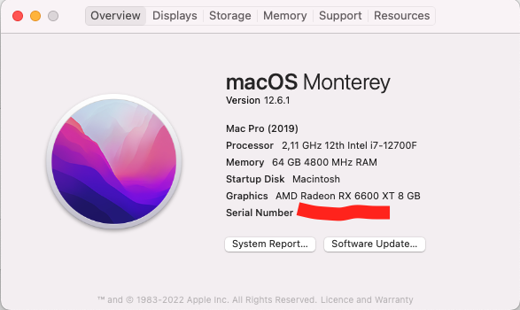
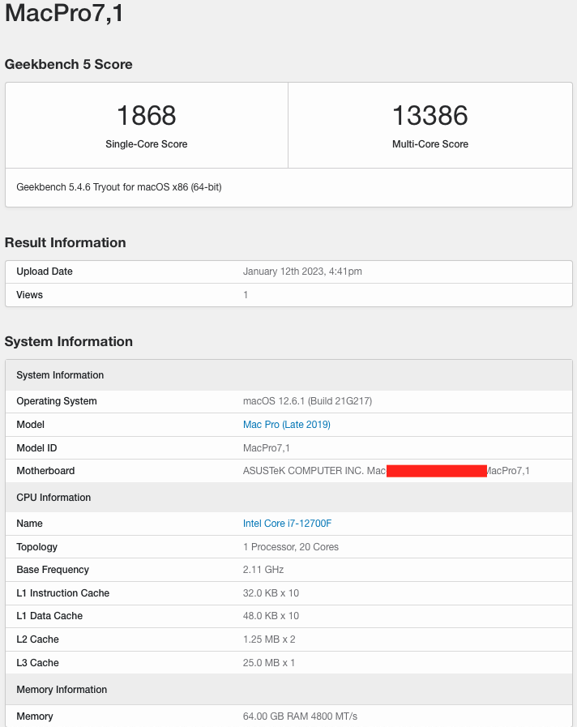
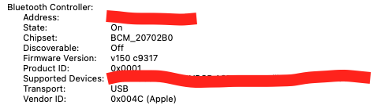

# Introduction

This EFI uses OpenCore 0.8.6 and is used for install Hackintosh Monterey 12.6.1.
Please make sure the system matches to the one you want, before using it.

One of the most important reason I choose MacOS Monterey 12.6.1 is the stability.
Currently Hackintosh with MacOS Ventura 13.1 is still unstable.

# Version

macOS Monterey 12.6.1
OpenCore: 0.8.6 (RELEASE)

# Hardware specs

| Hardware            | Brand                                           |
| ------------------- | ----------------------------------------------- |
| MotherBoard         | Asus B660i                                      |
| CPU                 | Intel 12700F                                    |
| GPU                 | Sapphire Nitro+ Radeon RX 6600 XT               |
| RAM                 | Corsair Vengeance schwarz DIMM Kit 64GB         |
| SSD                 | Western Digital WD_BLACK SN850 NVMe SSD 1TB * 2 |
| WIFI/Bluetooth Card | Broadcom BCM94360Z3                             |
| PSU                 | Corsair SF750                                   |

# What works

+ macOS Monterey
+ Shutdown
+ Reboot
+ Sleep
+ HDMI/DP
+ Ethernet
+ Wifi/BT
+ USB Ports
+ Audio
+ AirDrop/Handoff/Unlock with Apple Watch... (All Continuity features except Sidecar)
+ DRM

# What doesn't work

# To use this EFI

1. Check `https://dortania.github.io/OpenCore-Install-Guide/`_ for making MacOS installation USB drive.
2. In the section of **Config**, use the provided EFI to replace the one from USB drive.
3. Replace the default WIFI/Bluetooth card intel AX201 with Broadcom BCM94360Z3.
4. Connect all the hardware components.
5. Check the section of **Installation** to install MacOS in your new PC.

# BIOS Setup

+ Advanced > CPU Configuration > Intel (VMX) Virtualization Technology > Enabled (defalut)
+ Advanced > CPU Configuration > Active Performance Cores > All (i5 12400f have no E-Cores, unknown)
+ Advanced > CPU Configuration > Hyper-Threading > Enabled (defalut)
+ Advanced > System Agent (SA) Configuration > VT-d > Enabled (defalut)
+ Advanced > System Agent (SA) Configuration > Control Iommu Pre-boot Behavior > Disable IOMMU (default? not sure)
+ Advanced > PCI Subsystem Settings > Above 4G Decording > Enabled (defalut)
+ Advanced > PCI Subsystem Settings > Re-Size BAR Support > Enabled (defalut)
+ Advanced > USB Configuration > Legacy USB Support > Enabled
+ Advanced > USB Configuration > XHCI Hand-off > Enabled
+ Advanced > Network Stack Configuration > Network Stack > Disabled
+ Advanced > USB Configuration > Legacy USB Support > Enabled
+ Boot > CSM (Compatibility Support Module) > Launch CSM > Disabled
+ Boot > Secure Boot > OS Type > Other OS
+ Boot > Secure Boot Mode > Custom
+ Boot > Boot Configuration > Fast Boot > Disabled

# Screenshots

# Dual Boot with Windows 11

1. Download the Windows 11 iso from windows official website
2. Make the USB installation drive.
3. Install Windows 11

   + By default, Windows system cannot use the Broadcom WIFI/Bluetooth card. Therefore, at the stage **connect to internet** you cannot find any wifi, if you don't connect your PC with a LAN cable.
   + However, there is no button for skip this step by default. You can solve this issue by pressing **Shift** + **F10** to open the terminal and inputting `OOBE\BYPASSNRO` to skip this step.
4. When you finish the installation, download the file **win_10_64_bcm_driver.zip**, and install the drivers for bluetooth and wifi individually.

# Thanks/Credits

- [Opencore Team](https://dortania.github.io/getting-started/)
